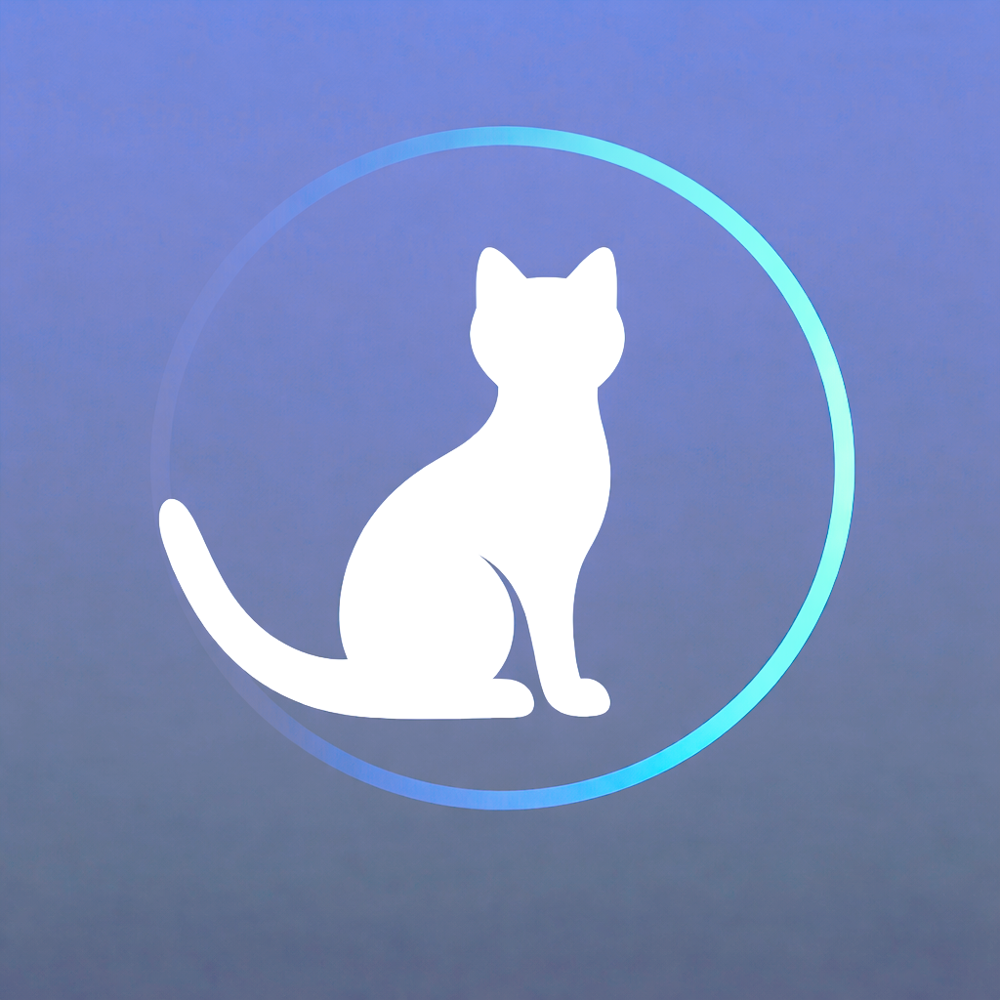

# 🐆 DailyPurrgress

<table>
<tr>
<td>

*Daily habits don’t have to be loud.*  

*Sometimes, they just* ***purr***.

</td>
<td align="right">

</td>
</tr>
</table>

---

**DailyPurrgress** is a minimalist habit-tracking app designed to make daily progress feel calm, visual, and rewarding through a cat-themed progression system.

This mini project was created for the **Swift Student Challenge 2026**, focusing on:

- Clear and intuitive SwiftUI design  
- Accessibility (VoiceOver support and thoughtful interaction feedback)  
- Lightweight, focused on user experience  

The app was primarily developed and refined as a full **Xcode project**, then carefully migrated to a **Swift Playgrounds (.swiftpm)** format specifically for SSC submission.

---

### Repository Structure

- `DailyPurrgressApp/` → Original Xcode development version  
- `DailyPurrgressPlaygrounds/` → Swift Playgrounds submission version
